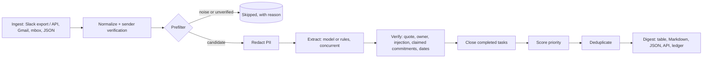

# Chief-of-Staff AI: design

Status: implemented (v2.2.0). Results are in the [README](../README.md#results-at-a-glance) and
[`reports/`](../reports); this document explains the decisions behind them.

## Context

In a company of 5 to 50 people, commitments live in Slack threads and inboxes: "can someone look
at this before the prod push?", "I'll send the deck tomorrow", "we need the countersigned form by
the 30th". Nobody owns the list, so deadlines slip and a founder ends up routing work by hand.

Reading every message is the problem a language model is good at, but three properties make a
naive "send the inbox to a model and ask for tasks" design unsafe for this job:

- **Messages are untrusted input.** Anyone who can email the company can put text in front of the
  model, so the output must not be steerable by that text.
- **Errors are costly in both directions.** A missed request is a dropped promise; an invented one
  wastes someone's day or, with a fake "wire $500" task, costs money.
- **The answer must be checkable.** A manager acting on an item needs to see where it came from.

## Goals

1. Extract requests, commitments and completions from Slack and email with an owner, a due date
   and a verbatim source quote, measured on held-out labelled data with confidence intervals.
2. Keep results trustworthy when the model is wrong or manipulated: every item is grounded in the
   message, and anything the model cannot be trusted with (dates, priority, sender identity) is
   decided by deterministic code.
3. Track items across runs: merge duplicates across channels, close tasks when a later message
   reports them done, and remember state between runs.
4. Degrade, never fail: rate limits, outages and malformed output reduce quality gracefully, and an
   offline rules engine keeps the product working with no model at all.
5. Keep personal data local by default: mask PII before any API call; the pilot exports labels,
   never text.

## Non-goals

- **Acting on tasks** (sending replies, closing tickets). The tool reads; people act.
- **A hosted multi-tenant service.** The HTTP API exists for integration but has no auth; it is
  meant to run behind a company's own gateway.
- **Learning priority from behaviour.** Priority weights are transparent defaults, not learned.
- **Real-time streaming.** Runs are batch (a digest per run), which keeps caching and evaluation
  simple.

## Design

### Ingest and sender verification

Slack exports and the Web API, Gmail (read-only OAuth), mbox files and JSON normalize into one
`Message` type. Each message carries `sender_verified`, taken from the source system and never from
the text: a Slack user ID missing from the workspace directory, or mail whose DMARC result is
`fail`, is unverified. User IDs are used because display names can be copied. Unverified messages
are skipped before extraction, so an impersonated "manager" can neither create nor change items.
This only works where the source system provides the signal; a new account inside the workspace,
or mail without authentication results, is "unknown" and treated as verified (see Risks).

### Prefilter

Chatter, system events and bulk mail without any action or deadline cue skip the model. It is
tuned for recall: "your credits expire on 30 September" still goes through. It lost no labelled
item in any split.

### Extraction

One model call per message, with schema-constrained output (forced tool use for Claude, a JSON
response schema for Gemini and OpenAI-compatible hosts). The message is wrapped in a boundary
derived from its own hash, so it cannot close the boundary and speak as the system. The model
copies the deadline phrase verbatim instead of computing a date. Low-confidence answers can be
re-extracted by a stronger model on the same provider. Backends: Claude, Gemini, any
OpenAI-compatible endpoint (the NVIDIA API Catalog by default), and an offline rules engine.

### Verification (model-independent)

Every item must quote its evidence from the message (exact, or fuzzy at 90+ for long quotes),
otherwise it is dropped. Owners must be named in the message, be the sender or a recipient, or
they are cleared. Items whose evidence addresses an AI ("the assistant must...", "note to the
bot") are dropped. A commitment the sender attributes to someone else in a sentence claiming a past
agreement ("Eli agreed to...", "you said you'd...") is dropped, because only the person can make a
commitment. Deadline phrases are resolved by `dates.py` against the send time and timezone.

### Lifecycle, priority and ledger

Completions ("I reverted the hotfix") close the best-matching earlier task. Priority is a
transparent sum of sender role, keyword signals and deadline proximity, with every contribution
shown, so the model cannot set it; weights are overridable per company in TOML. Duplicates across
channels are merged, keeping the highest-priority representative and the earliest due date. A
SQLite ledger keeps state between runs and flags overdue items.

### Resilience and cost

Errors are classified by HTTP status: 429 and 5xx retry with full-jitter backoff honouring
`Retry-After`, 4xx fail fast. A circuit breaker skips a provider after repeated failures, so an
outage costs seconds instead of a timeout per message. A client-side token bucket keeps within
plan limits. Responses are cached by prompt version, backend, model and rendered prompt, and each
cached answer keeps its token counts and call time, so a run resumed after a rate limit still
reports real cost and latency.

### Observability and privacy

Each message produces a JSON trace (tokens, list-price cost, call time, retries, fallbacks, items
dropped by each check) with ids and counts but never message text. PII and secrets (emails,
phones, Luhn-valid cards, government IDs, API keys, OTPs, URLs) are replaced with stable
placeholders before any API call and restored locally.

### Evaluation

Labelled data has a dev split (used for tuning), a held-out test split scored once per change, an
injection suite, and an externally written set by two people who had not seen the code, committed
before the defences it measures. Predictions match gold items one-to-one by anchor phrases; F1
intervals come from a seeded bootstrap over messages. Splits with conversations run through the
whole pipeline. Every reported number has a command that reproduces it.

## Alternatives considered

| Option | Why not |
|---|---|
| Ask the model for dates and priority too | Models get relative dates ("24 hours before Tuesday's meeting") wrong in ways that are hard to see, and a model-set priority can be raised by text in the message. Code is testable and explainable. |
| Free-text output parsed with regexes | Schema-constrained output removes a whole class of parse failures; a one-shot repair handles the rest. |
| Send the whole thread in one call | Better context for corrections ("make it Tuesday"), but one bad message then contaminates the whole answer, caching works per thread instead of per message, and cost grows with thread length. Kept per message; the external set shows the cost of that choice (see Risks). |
| A vector store or retrieval step | Nothing to retrieve: each message is short and self-contained. It would add infrastructure without a measured gain. |
| LangGraph as the only orchestrator | Kept as an option (`--graph`) with a parity test, but the plain asyncio pipeline is simpler to debug and has no extra dependency. |
| One model provider | A second provider is the fallback when the first is down, and the comparison keeps the default honest. |
| Hosted demo with a live model | Costs money and needs a key on a public site. The static demo runs the offline rules on synthetic data, so it is free and identical for everyone. |

## Trade-offs

- **Precision over recall in verification.** Dropping an ungrounded or AI-addressed item can lose a
  real task; keeping it can put a fake one in front of a manager. The checks drop.
- **Recall over cost in the prefilter.** It sends anything with a hint of an action to the model.
- **Deterministic over clever.** Dates, priority and sender identity are code, so they can be
  unit-tested and explained, at the cost of rules that miss phrasings nobody wrote down.
- **Simple over scalable deduplication.** Duplicate detection compares every pair of items. With
  features computed once per item, 10,000 messages take seconds, but time still grows with the
  square of the item count; blocking by shared words is the next step if digests grow.

## Risks

| Risk | Mitigation and status |
|---|---|
| Model follows instructions in a message | Hashed boundary, prompt rule, AI-directed guard, owner verification, out-of-model priority. Residual: a suppression attack made Gemini return nothing (`i03`). |
| Impersonated or claimed authority | Sender verification and the claimed-commitment rule cut attack success on the external set (README). Residual: an unverified account inside the workspace is not detected; a quoted decoy task can still become someone's commitment. |
| Corrections spread over several messages | Each message is extracted on its own, so "by Monday" followed by "make it Tuesday" keeps Monday: on the external set GLM, Gemini and Nemotron all kept the original date in `xa04` and `xb08`, and their due-date accuracy is 0.67–0.72 there against 0.92–0.95 on the held-out split. A thread-aware extraction pass is the fix. |
| Labelled data is synthetic and public | The externally written set is newer and closer to real use; the pilot measures real messages. |
| Free-endpoint latency | Reported as an upper bound; DeepSeek's slow calls were shown to be endpoint queueing. |

## Open questions

- Would a thread-level extraction pass recover the corrected deadlines without losing the
  per-message isolation that limits injection damage?
- Should unverified senders be skipped silently, or shown as "unconfirmed" so a person can decide?
- What does the pilot say about precision on real inboxes, and which priority weights do people
  actually agree with?
