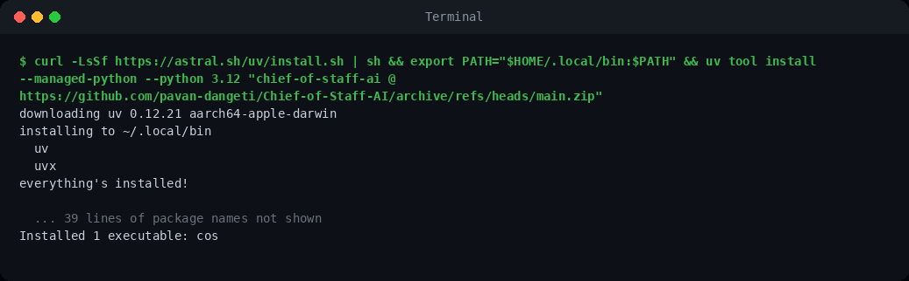

# Pilot guide

This guide is for people taking part in the two-week pilot. Please read the
[privacy and consent note](pilot-privacy.md) first. You will need about 10 minutes to set up and
10 to 15 minutes each time you review.

## 1. Install (once, about a minute)

Copy the one line for your computer, paste it, and press Enter. You do not need Python, git or
administrator rights: the installer ([uv](https://docs.astral.sh/uv/)) fetches its own copy of
Python and installs the tool for your user only.

**Mac**: open *Terminal* (press Cmd+Space, type Terminal, press Enter) and paste:

```
curl -LsSf https://astral.sh/uv/install.sh | sh && export PATH="$HOME/.local/bin:$PATH" && uv tool install --managed-python --python 3.12 "chief-of-staff-ai @ https://github.com/pavan-dangeti/Chief-of-Staff-AI/archive/refs/tags/v2.2.0.zip"
```

**Windows**: open *PowerShell* (press the Windows key, type PowerShell, press Enter) and paste:

```
powershell -ExecutionPolicy ByPass -c "irm https://astral.sh/uv/install.ps1 | iex"; $env:Path = "$env:USERPROFILE\.local\bin;$env:Path"; uv tool install --managed-python --python 3.12 "chief-of-staff-ai @ https://github.com/pavan-dangeti/Chief-of-Staff-AI/archive/refs/tags/v2.2.0.zip"
```

It has worked when the last line says **`Installed 1 executable: cos`**:



The `cos` command is ready in that window straight away, and in any new window you open. Both
lines are tested on fresh macOS and Windows machines on every change to the project. To remove
everything later: `uv tool uninstall chief-of-staff-ai`.

## 2. Export your messages

Use **your own personal accounts only**, never a work account unless your employer approved it.

- **Gmail**: go to [takeout.google.com](https://takeout.google.com), choose *Deselect all*, tick
  *Mail*, and under *All Mail data included* pick only *Inbox* to keep the file small. Create the
  export, download the zip when Google emails you, and unzip it. The file you need ends in `.mbox`.
- **Slack**: exports are available to owners and admins of a workspace (Workspace settings, then
  *Import/Export Data*, then *Export*). Use this only for a personal workspace you run. Unzip the
  download into a folder.

## 3. Run the tool (twice: once a week)

Your organiser gives you a pilot code such as `P3`. Run one of these, with your own file path:

```bash
cos pilot run --participant P3 --mbox "path/to/Inbox.mbox"
cos pilot run --participant P3 --slack-export "path/to/slack-export-folder"
```

It reads only the last 14 days (change with `--days`), works offline, and prints the path of a
page to open. Nothing is sent anywhere.

## 4. Review in your browser

Open the page it printed. For each task, choose:

- **Real task, details right**: someone really has to do this, and the owner and due date shown
  are right (or correctly empty);
- **Real task, details wrong**: a real task, but the owner or due date is wrong;
- **Not a task**: nobody actually has to do this.

Then add any real task from those messages that the tool did not list, under *Tasks the tool
missed*. The note box is for you only and is never sent. Your progress is saved as you go.

## 5. Send your file

Press **Save labels**. Your browser downloads `pilot-P3-<run>.json`. You can open it in a text
editor to check that it contains no message text. Send that file to your organiser. That is all.

---

## For the organiser

Put the returned files in one folder and run:

```bash
cos pilot report pilot-results/*.json --output reports/pilot.md
```

It checks every file against the export format (a file with any extra field is rejected), keeps
the latest file when a participant sent the same run twice, and prints precision, the share of
real tasks with owner and due date right, and a recall estimate from the missed tasks, per
participant and in total.
